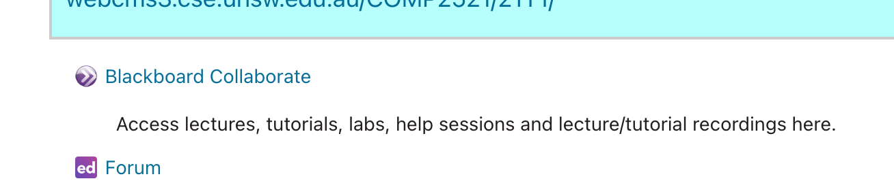

# Blackboard Guide

Open mooodle, find comp2521, go to Blackboard Collaborate as per below and click on it.

Then you click on the three line icon on top left and then click on recordings.

Then go ahead and watch the recordings!!  Cheers.
