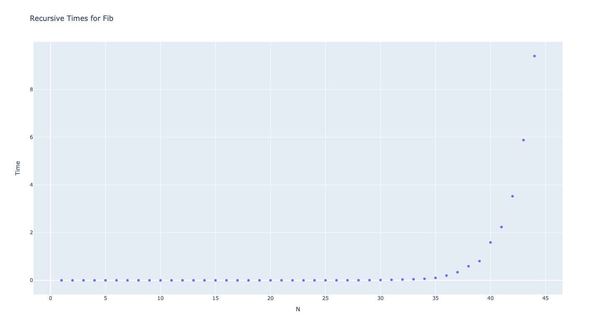
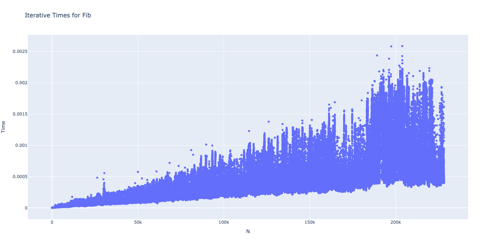
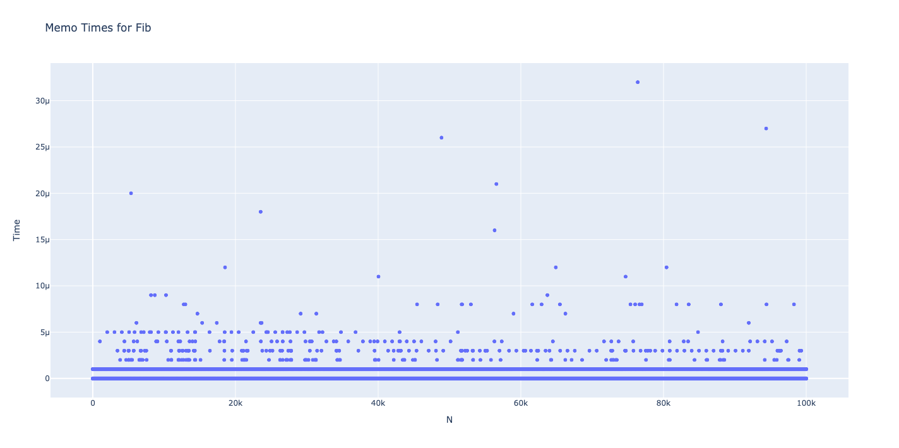

# Week 2

> Time to diverge a little

This week we are going to cover the same content as the tutorial but in a more natural way.  We are going to prove things both experimentally and 'theoretically' rather than just rely on the shoulders of CS history.

## The 'simplest' math explanation of Big O

Imagine you are playing a cookie clicker game like below.


Every time you click the big cookie on the left you get a single cookie.  You can spend these cookies to buy 'factories' (or 'grandmas' whatever those are) that cook said cookies.  Then you can build cookie farms and mines and so on.  Each 'factory' producing more cookies than the last (getting you way above trillions of cookies quickly).

When you are at a cookie by cookie basis each cookie matters, 49 vs 50 makes a huge difference to what you can do.  However, when you get to let's say 4 trillion cookies no longer does '1' cookie actually matter, the game won't even display it.  It's a 'rounding error'.

This is the core of Big O.  We want to find the largest factor that matters.  If I make 4.9 trillion cookies per second the only factor I really care about here is 1 trillion, the factor of 4.9 is mostly irrelevant (only taking 5x longer to get the same amount) where as 1 trillion vs 1 billion is a huge difference taking 1000x more time.

## Examples

Let's say you have the following equation.

$$ F(x) = x^3 + x^2 + x / x^9 $$

All we need to do is 'imagine' and take the numbers to be extremely large.  If these are numbers are really big what is the 'factor' that is going to contribute the most?

The answer is $$ O(F(x)) = x^3 $$ we call this Big O, we also have Big θ (Theta) and Big Ω (Omega) but we'll come to those briefly in a bit.

Another quick example is;

$$ F(x) = x^3 / 1000 * log(x) $$

The answer is $$ O(F(x)) = log(x) * x^3 $$, the constant numbers don't matter just like 4.9 trillion doesn't matter compared to 1 trillion.

You may ask what the hell does this mean in computer science?  How can we apply this?  Glad you asked!!

## Functions!

Let's look at a very simple function.

```c
int count_length(char *string, int size) {
    if (rand() % 100 == 1) {
        // lucky!
        return size;
    } else {
        // being able to read code like this will save you tons of effort
        // people like being 'smart' and writing fancy while loops
        char *s = string
        while (s && *s) s++;

        // if we have a 1 char string "a\0" then `string` points to 'a'
        // and `s` points to '\0' (since it keeps going until it finds 0)
        // therefore length is 1 as expected since 's' is 1 more.
        return s - string;
    }
}
```

> This may seem like a more complicated example but we'll see why cases like this are why Big O exists!!

How fast does this program run?  There is a 1% chance that it executes instantly in which case we call it O(1) since it doesn't have any 'scaling' properties it's simply the same speed each time (roughly ignoring constants).

But what for the other 99%?  Well in those cases we have to read through the entire string!!!!  How expensive is this?  Well there are so many little components that make it hard to guess.  So what do we do?

Make it big!!  Pretend the string is so large that all the little factors go away all you are left with is the size of the string.  In which case our scaling factor is the while loop, it's the only thing that scales with length.  How much does it scale?

Well we have a string of length `size` characters meaning we have to read through `size + 1` in the while loop but again ignore constants so it's just `O(size)`.  We typically call this `O(N)` where `N` is a generic 'length'.

### But how do we combine the two?

Well technically there is a very fancy way you can handle random algorithms and complexities but for our use cases we aren't going to bother with that in this course (extended algos if you want to look at it).  Instead we are just going to look at the 3 cases.

- Best Case is Big Ω (Omega) which is Ω(1)
- Worst Case is Big O which is O(N)
- Average Case is Big θ (Theta) which is θ(0.99 N + 0.01) = θ(N) (i.e. 99% of runs are effected by N with 1% effected by constant)

Hopefully this makes a lot more sense.

## Recursion and the Stack

Time for some drawing + explanation of Fib.

And a real example of performance of fibonnaci.

Results of our fib experiments...

<details>
<summary>Performance Graphs for Recursive</summary>



</details>

<details>
<summary>Performance Graphs for Iterative</summary>



</details>

<details>
<summary>Performance Graphs for Memo</summary>



</details>

## Logarithmic Intuition

A common issue students have is 'visualising' logarithmic growth.  Exponential growth is typically quite easy (i.e. a disease effecting 2 people who each effect 2 and so on, quite 'topical') to visualise but Logarithmic isn't.

The trick about logarithmic is thinking about what we call the problem/solution space.  It's a very fancy way of saying think about every single 'solution' or 'possible answer' to your problem.

Let's say we are looking through an array to find an item we want.  We could look 'linearly' from left -> right, hoping to stumble across it and have to see O(N) items worst case.  Or we could use binary search.  Binary search works similar to the 'guess a number game'.

Guess a number is straightforward, I think of a number and you get 7 guesses with each guess getting one of three answers; 'correct', 'higher', or 'lower'.  If you know what to pick you'll win every time.  The trick is trying to make a guess that REMOVES the most possible answers rather than looking for the right one.

For example if I guess 98 and I'm correct that's fantastic but if I'm wrong and you say lower than I've only removed 3 answers!  Where as if I say 50 regardless of if you say higher/lower I've cut away 50 answers!  If I keep repeating this over and over again i.e. for 89

- guess 50; 'higher'
- guess 75; 'higher'
- guess 88 (I'm rounding up doesn't matter though); 'higher' 
- guess 94; 'lower'
- guess 91; 'lower'
- guess 89; Success!

And I solved it in only 6 guesses!

How much of the problem space are we chucking out each time?  Half the problem space!  So it is $$log_2(N)$$ (where N is the max problem space).  How can we prove to ourselves this is true?  Well what is $$log_2(100)$$?  It's 6.6 which rounds to 7!

Finally I should conclude this by saying the $$log_2(N)$$ is just stated as $$log(N)$$ because the 'base' of the log is just a constant factor, you don't believe me?  Well let's prove it!

The log laws state that $$log_b(a) = log_c(a) / log_c(b)$$ that is we can change the base by just dividing by a constant factor the $$log_c(b)$$ bit (since presuming bases are constant here, if they aren't they definitely will matter).  Therefore we would say binary search is $$O(log(n))$$

So if you chuck any 'percentage' of the problem set consistently (half, quarter, ...) then you'll have a logarithmic algorithm.

## What we won't cover and you should try to do yourself.

I'll write up detailed solutions later but you should attempt to solve these yourself.  If someone emails me a solution prior to me finishing them (Thurs/Fri) I'll send cute photos of my 2 very cute cats (or of my 2 very cute dogs whichever you prefer) to the class!

I do recommend people do this!  It'll be great practice.

### 1) Polynomial Calculator

Let's say you have a function like; $$p(x) = a_0 + a_1 x + a_2 x^2 + \dots + a_{n-1} x^{n-1} + a_n x^n $$

Now let's say we want to calculate that expression, what's the fastest way?

Well a very 'quick way' is

```c
// note length of a is going to be n + 1 since it goes from a_0 to a_n
int evalPoly(int n, int a[], int x) {
    int result = 0;
    for (int i = 0; i <= n; i++) {
        // pow(x, i) is going to do x^i
        // i.e. pow(2, 3) is 2^3 = 2 * 2 * 2 = 8
        result += a[i] * pow(x, i);
    }
    return result;
}
```

1. How fast is this?
2. How fast is pow?  Keep in mind it's just a simple implementation like the next question (not the O(logn) though that doesn't matter we'll make it faster than that even).
3. Can we eliminate pow?  Can we refactor the polynomial?

<details>
<summary>More Hints</summary>

Refactoring polynomial gives us

$$ p(x) = a_0 + x * (a_1 + x * (a_2 + x * \dots)) $$

You'll notice that there are only `n` multiplications now as long as we keep track of the previous `x` result.

</details>

### 2) Binary Search Recursively

```c
// returns index of matched value and -1 if no index found
int binarySearch(int A[], int n, int value) {
	int lo = 0;
	int hi = n - 1;
	while (lo <= hi) {
		int mid = (lo + hi) / 2;
		
		if (A[mid] == value) {
			return mid;
		} else if (value < A[mid]) {
			hi = mid - 1;
		} else {
			lo = mid + 1;
		}
	}
	return -1; // can't find value
}
```

Rewrite above recursively using the following signature.

```c
// think of base case!  i.e. when in middle
int binarySearch(int A[], int lo, int hi, int value) {
    //  TODO
    return -1;
}

// called like binarySearch(array, 0, length, myValue)
```

And if you really want you can try matching it to the following signature

```c
// binary search without low/high variables :O
// and no you can't create another function!  This is your only one
int binarySearch(int *A, int length, int value) {
    // TODO
    return -1;
}
```

Hints:
- The use of `*A` vs `A[]` indicates pointer math may be needed
    - NOTE: there is no difference between the two (arrays are only special when created in function locally)
- This is a more 'typical' approach to recursion, try to think up of a wave to make the array physically smaller by manipulating length/starting point (A) rather than low/high.

### 3) Extension: Pow (hard only if you feel like it)

> I have 0 clue why this was in the notes, the solution is NOT intuitive so do not feel bad for googling but what I recommend is having a look at this 'reasonably' simple equation.

For $$x^n$$ IF:
- `n` is odd: $$x^n = x * (x^2)^{\frac{n - 1}{2}}$$
- `n` is even: $$x^n = (x^2)^{\frac{x}{2}}$$

First prove those equations to yourself (I'll do a very quick 'proof') then try to use them to solve this.

We need to convert the following equation to O(log(n)) rather than O(n) this is using something called divide and conquer i.e. split it up into smaller parts which are easier to solve.

```c
// calculate x raised to the power of n
// i.e. pow(3, 2) is 3^2 = 3 * 3 = 9
// you can presume n is positive.
int pow(int x, int n) {
	int res = 1;
	for (int i = 1; i <= n; i++) {
		res = res * x;
	}
	return res;
}
```

Hints:

1. What is the complexity of Pow?  Think about the 'scaling' factors
2. What is the base case?  The case you can solve easily, solving this recursively is probably easier
3. Prove the math works!  Each time you run it you end up with a smaller `n` factor, until the base factor.

### Any more?

You can check webcms tutorial notes for more problems.
