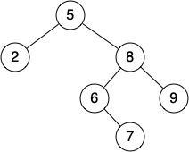

# Wk 4

<!-- for me -->
<!-- [Whiteboard App](https://app.ziteboard.com/) -->

## Function Pointers

> This diverges from the tute, since personally I don't like examples like they gave.

To understand function pointers we have to first understand what a function is!

### What is a function?

A function is simply just a pointer to a location in memory, however this time it's memory that contains 'code' or instructions!  We can ask the computer to 'jump' to this code!

Investigation...

```c
int foo(int a) {
   return a; 
}

int bar(void) {
    return foo(42);
}

int main(void) {
    // Function pointers are really ugly
    // the way they are done are...
    // 'return type' (*'name')('args')
    // i.e. typedef int (*foo_fn)(int)
    int (*ptr)(int) = &foo;

    // this is 'technically' fine on most compilers
    // but some environments it won't work since
    // sizeof function_ptr != sizeof ptr (funnily enough)
    // void *ptr_void = &foo;

    printf("%p\n", ptr);
    return 0;
}
```

We can even read the 'raw' instructions from them...!!

<details>
<summary>Answer/Hint</summary>

[Tool](https://braedonwooding.github.io/BitwiseCmpViz/#/)
[MIPS Format](http://max.cs.kzoo.edu/cs230/Resources/MIPS/MachineXL/InstructionFormats.html)

<iframe width="800px" height="200px" src="https://godbolt.org/e#z:OYLghAFBqd5QCxAYwPYBMCmBRdBLAF1QCcAaPECAM1QDsCBlZAQwBtMQBGAFlICsupVs1qhkAUgBMAISnTSAZ0ztkBPHUqZa6AMKpWAVwC2tQVvQAZPLUwA5YwCNMxEAGZOpAA6oFhdbT1DE0FvXzU6Kxt7IycXd0VlTFV/BgJmYgJA41MPJRVw2lT0gki7R2c3XLSMrOCq4tLo2MqASkVUA2JkDgByKVdrZEMsAGpxVx0FAnxUADoEcexxAAYAQRXV6wIRmlQILZHmFrGAdlk1kcviTAJO2kPx6TG18ROAEQ2Ng4d0iAA3VB4dDHV7nVaXK43O47VB7biSFqPT7vT5rAFAna0fb0EYQABUngIxBa2IILRBZw2EJGhOIEB%2BdPJSJeKJeawORmY1n%2BgOBpzB1IA9IKRgAxAy0ZJ0GmA%2BjOBSHa4ja5sVgATxGBmA6qpEOFIwICEwIwA7swNYbMBr0sb0HRjTbZk7dZd9WAetdbsR7gQ1Z5MO7cXj3bRmEYAz0Se70sAFO7ERc9SK8LNMLMDX7MFgqCMDvjdgB9Ki0ElbBPgiF5glE0v0EGuN5jSQANl2zIrl08xC2VAgUkkAAUibmFSAmwBWTzicc6Wj90g0mvt6kS3zAGzoXM44jME1jBsjPGkvEk2mI1xgl2YiBn5cQq9dnt9ySSUV4YhTLdTYgGKX3PAKssAAeUjjiBM5zi%2BC47ia54ChCq54OuWZbtsqCePujYQDB%2B5LK42AjC2IItiMwGuFQd6XIhyGbgcH6YbiOGLIshGcMRzakUBnAUReV7URuqHKts4xYUx%2BEsZwzbsZx3GUZqtBrgJBx4EYRgMUxJHAVQ2k8Zeiadt29C9v2wGgUBnFmRZkhgVZYHTrO84jOh0EKNBBALipRhwVe%2BpGHgngKt%2Bv5esaNDEIc/5fkSqIdiM%2BphZqCqEO6gWsEhCAEOqIz4NpzhaNsEBAQAHFJV7IAg6SHugzBpAxEDlekJ5SM2MFyY%2BRnPpIpnWeZ3U2X1vUgT19mQZIC5aTmzXZTVzDTtIyzTm841AdpTYcdVaRzZwi3LatU0bbN47SJIO2cXtJEHXNriLd5bKxZ60ILbxLJvJGQggD0449KQpg9Ms32oB9OhyHIIwKB0XTGv0nDfQQH3/eSpBGswWAuBAbQANZuK4syuHj%2BMEwTzbvT03Dfb9/2kIDPTfQoIDLKQcN/W9cCwEgaBGJ4eDsGQFD1agnPcxUQwiMAnCcMsHhUNzBDypQDjw99DjWOkaqK6QHPhvQADytDqurWCcqI7AG%2B%2BSRqH8mB08zpCYEBSQGLLH0w%2BQcqsOraUODuxBqnoWDq0SKmK20ND0EwbAcDw/CCMIogoCDMhCHgDh05AbToQU1u04kf6aNotQ5K4tvaI05QuCcXg%2BH4dAF1wRehNXtClzEFQV3k5spNUmT6NkdcJPkncNNYZQt%2BXihd7XnBF1MQ9RGXIAnG04OdN0XBtO7n3k%2Br1PFc2AC0zbcCMIuiCM4uzMssycLiuCECQTbxCMeiCzzD9sU/CfSLDweY9juOEwAvGxMN5kx%2BtvD6tN6aM2DqQVmiAQB2wdkQXmlAYwKAHCIZQDAECoBNL9F2HMubCAKBgmwrBsG4Ipt9QhQsXAnzFhLDwNCeba0dhQvB6tEHIFWMQWMEDbb22QKkfAv1vqh0YCwE2UcBAeFjmIT%2BScU7wHToSfwWd2gr0juPERpCsE4I4T0F2JodyeGdm9DeX0wE2x3iVA%2BR96Fn04BfK%2BIxsCCMdvfCAt9kFv2OMDGQchv7M0RljPG/9AGExJqAqhVN%2BF0wZkzBG68PqSC3tY/hiTIxtEth%2BfwIBuBAA%3D%3D%3D"></iframe>

</details>

## Use cases; qsort

```c
#include <stdio.h>
#include <stdlib.h>

/*
    1:  if a > b
   -1:  if a < b
    0:  if a == b

i.e. strcmp
 */
int cmpfunc(int a, int b) {
    return ( *(int*)a - *(int*)b );
}

int main () {
    int values[] = { 88, 56, 100, 2, 25 };
    int length = sizeof(values) / sizeof(values[0]);

    printf("Before sorting the list is: \n");
    for(int n = 0 ; n < length; n++) {
        printf("%d ", values[n]);
    }

    qsort(values, length, sizeof(int), cmpfunc);

    printf("\nAfter sorting the list is: \n");
    for(int n = 0 ; n < length; n++) {   
        printf("%d ", values[n]);
    }

    return(0);
}
```

## Use cases; bsearch

Let's write our own

```c
// Binary search
void *bsearch(const void *key, const void *first, size_t len, size_t sizeof_bytes, int (*compare_fn) (const void *, const void *)) {
    // TODO:
}
```

### Side Note: Functional Programming

Functional programming is really awesome, let's do a very quick 10 minute demo.

## Binary Search Trees and Rotations / Balancing

1. Show how the following tree would change if we do a right rotation on the node containing 10 followed by a left rotation on the node containing 6.


2. Show the sequence of rotations that would be required to move the node containing the 7 to the root of this binary tree:



### Height Balanced

Implement the following function that returns the height of a given basic binary tree if it is height-balanced. Otherwise, if the given binary tree is not height-balanced, the function returns NOT_HEIGHT_BALANCED.

__Height-balanced tree:__ We say that a basic binary tree is height-balanced if, for every node, the absolute difference between the height of the left subtree and the height of the right subtree is one or less. In other words, every node needs to satisfy the following criteria: `abs(height(left) - height(right)) ≤ 1`

```c
#define NOT_HEIGHT_BALANCED -99

typedef struct BSTNode *BSTree;
typedef struct BSTNode {
	int value;
	BSTree left;
	BSTree right;
} BSTNode;

int isHeightBalanced(BSTree t) {
}
```

