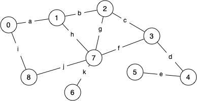

# Week 5

## Balanced Trees

<!-- for me -->
<!-- [Whiteboard App](https://app.ziteboard.com/) -->

### Splay Trees

We briefly have mentioned these I believe but we'll go into more detail now.

1. Construct a splay tree from `5 3 8 7 4`

2. Let your tree be the answer to question 1, and now perform searches for `7, 8, 6` and show how it changes overtime.  What do you notice at some points?

### AVL Trees

Show how an AVL tree would be constructed if the following values were inserted into an empty tree in the order given `12 10 8 6 4 2`

### 2-3-4 Trees

Show a 2-3-4 tree would be constructed if the following values were inserted into an empty tree `1 2 3 4 5 8 6 7 9 10`.

How costly are the searches for `1 7 9 13` in terms of comparisons.

### AVL vs Splay Trees

When is one preferred over the other?  What's the difference in performance?

## Graphs

### Representations

For the graphs below show both Adjacency and List Representations (non directional should be counted as bi-directional).

### Graph notation

1. How many edges and how many nodes?
2. How many cycles?
3. How many cliques? (complete subgraph with atleast 3 nodes)
4. What is the degree of each vertex?
5. How many edges in the longest path from 5 to 8? (without traversing a node more than once)

### Facebook

Facebook is effectively a big 'social graph' so...

1. what are the vertices?
2. what are the edges?
3. are edges directional?
4. what degree does each vertex represent?
5. what kind of graph algorithm could recommend friends?

#### SideNote: Databases...

If we get time I'll talk about how we can represent a graph in memory in database form which can be more common :).
