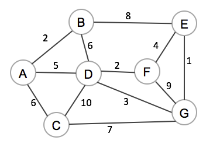

# Week 8

## Reachable

Write a C function to find how many vertices can be found from a given vertex.

```c
typedef struct Set *Set;
typedef struct Queue *Queue;
typedef struct Graph *Graph;

typedef int Vertex;

Set newSet(int len);
Queue newQueue(void);

void enqueue(Queue q, Vertex v);
Vertex dequeue(Queue q);
int queueLen(Queue q);

void addToSet(Set s, Vertex v);
int setHasElement(Set s, Vertex v);

int graphNumV(Graph g);
int graphAdjacent(Graph g, Vertex from, Vertex to);

// Could you do this recursively?
Set reachable(Graph g, Vertex v) {
    Set seen = newSet(graphNumV(g));

    return seen;
}
```

## Hamilton path/tour vs Euler path/tour

?> What is the difference between Euler and Hamilton?  Hint: The first letter of Euler

?> What is the difference between a path and a tour

For the following graphs denote which ones have tours/paths and what the path/tour is.


## Another Example


In above find a hamilton path/tour if it exists and if it doesn't modify it so that one exists.

## Interesting tidbit finding if a path exists for hamilton/euler

Euler is pretty easy it is just if all vertices have an even degree in a connected graph.  The proof is relatively straightforward.  NOTE: finding out if a graph doesn't have an euler path isn't as simple as just stating that if the above theorem doesn't hold it doesn't have an euler path it is not like that.  For example (4 vertex graph 1 -> 2 and 3, 2 -> 1 and 3, 3 -> 1 and 2 and 4 has an euler path (but no tour) but doesn't hold for the above theorem.

Hamilton is a bit more tricky and is technically NP-Complete (i.e. very tricky) for quite a few types of graphs.

## Dijkstra's Algorithm


Trace Dijkstra's Algorithm to compute minimum distances from source node 0 to all other vertices.

Show vSet, dist[] and pred[] on each iteration.

Initial:

```c
vSet = { 0, 1, 2, 3, 4, 5, 6, 7 }
dist = [ 0, ∞, ∞, ∞, ∞, ∞, ∞, ∞ }
pred = [ -1, -1, -1, -1, -1, -1, -1, -1 }
```

## Kruskal's Algorithm

!> What does mst or minimum spanning tree even mean?


The following code is from lectures

```c
Graph kruskalFindMST(Graph g) {
    Graph mst = newGraph(); // create empty forest
    // Tutorial notes use VLA's (discuss why it is bad)
    Edge *edges = malloc(sizeof(Edge) * g->nE);
    getEdges(edges, g->nE, g);
    // edgeCmp cmps to edges like strcmp
    qsort(edges, g->nE, sizeof(Edge), edgeCmp);

    for (int i = 0; mst->nE < g->nV - 1; i++) {
        // we still have vertices/edges to add
        Edge e = edges[i];
        insertEdge(mst, e);
        if (hasCycle(mst)) {
            removeEdge(mst, e);
        }
    }

    free(edges);
}
```

?> Apply the algorithm above to the graph given.

## Prim's Algorithm



Starting choosing A as root

```c
// A = 1, B = 2, C = 3, D = 4, E = 5, F = 6, G = 7
parent = [ -1, -1, -1, -1, -1, -1, -1 ]
priority_queue = { (B, 2), (D, 5), (C, 6) }
seen = [ True, False, False, False, False, False, False ]
```
