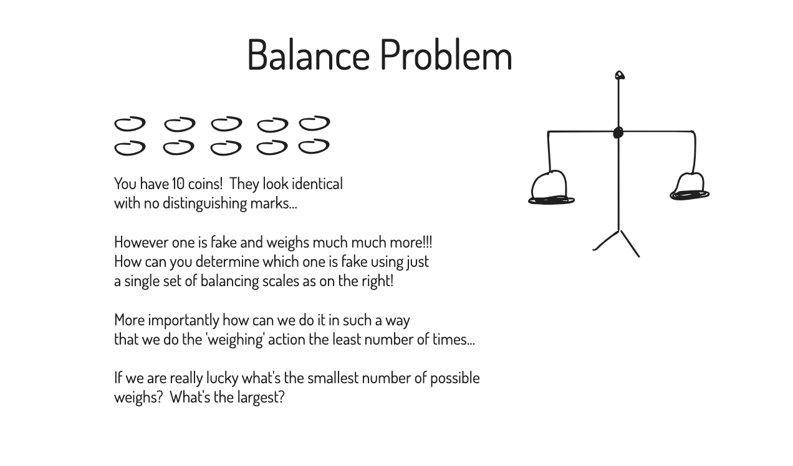

# Wk1

## Introductions



## Some simple functions

- `swap(a, i, j)` for an array a

<details>
<summary>Answer</summary>

```c
void swap(int *array, int i, int j) {
	// store temporary so we don't lose array[i] in next step
	int tmp = array[i];
	array[i] = array[j];
	array[j] = tmp;
}
```

</details>

## What is the below function?

```c
#include <stdio.h>
#include <assert.h>

int main(int argc, char *argv[])
{
	int i, j, *a;
	int N = 0;

	// initialisation
	assert(argc > 1);
	sscanf(argv[1], "%d", &N);
	assert(N > 0);
	
	a = malloc(N * sizeof(int));
	assert(a != NULL);
	
	for (i = 2; i < N; i++) a[i] = 1;

	// computation
	for (i = 2; i < N; i++) {
		if (a[i]) {
			for (j = i; i * j < N; j++) a[i * j] = 0;
		}
	}

	// results
	for (i = 2; i < N; i++) {
		if (a[i]) printf("%d\n", i);
	}
	return EXIT_SUCCESS;
}
```

Questions

1. There are no braces for some of the for loops?  Does that matter?
2. What is the line `sscanf(argv[1], "%d", &N);` doing?
3. Alternative for `sscanf`
4. For each assert, what is it checking and could you manually check it and what would be the benefits of manually checking it?
5. What is a[0], a[1] through the program, do they matter?

What does the above program do?

<details>
<summary>Answer</summary>

1. No as long as it's on the same line it's fine, it'll stop at next semicolon / end of statement
2. Scans through a string just like as if it was stdin to read in an integer
3. atoi, strtol
4. Some are preconditions i.e. `argc > 1` and `N > 0`, others are invariants i.e. `a != NULL`, pre conditions often work best if they produce a nicer readable error or return an error rather than being asserts.  The null check is fine as an assert though.
5. They are always undefined and don't matter since no code ever reads from them.

The program is a [Sieve of Eratosthenes](https://en.wikipedia.org/wiki/Sieve_of_Eratosthenes).

</details>

## New C Syntax

### 1

How can we make the following bit of code nicer?

```c
char *numToDay(int n)
{
	assert(0 <= n && n <= 6);
	char *day;
	if (n == 0) {
		day = "Sun";
	} else if (n == 1) {
		day = "Mon";
	} else if (n == 2) {
		day = "Tue";
	} else if (n == 3) {
		day = "Wed";
	} else if (n == 4) {
		day = "Thu";
	} else if (n == 5) {
		day = "Fri";
	} else if (n == 6) {
		day = "Sat";
	}
	return day;
}
```

<details>
<summary>Answer</summary>

```c
char *numToDay(int n) {
	char *day;
	switch (n) {
		case 0: day = "Sun"; break;
		case 1: day = "Mon"; break;
		case 2: day = "Tue"; break;
		case 3: day = "Wed"; break;
		case 4: day = "Thu"; break;
		case 5: day = "Fri"; break;
		case 6: day = "Sat"; break;
		default: day = NULL; break;
	}
	return day;
}
```

Or preferably more compactly like;

```c
char *numToDay(int n) {
	switch (n) {
		case 0:  return "Sun";
		case 1:  return "Mon";
		case 2:  return "Tue";
		case 3:  return "Wed";
		case 4:  return "Thu";
		case 5:  return "Fri";
		case 6:  return "Sat";
		default: return NULL;
	}
}
```

This effectively is pretty close to this (it's a computed goto);

```c
char *numToDay(int n) {
	static char *days[7] = {"Sun", "Mon", "Tue", "Wed", "Thu", "Fri", "Sat"};
	
	if (n < 0 || n > 6) return NULL;
	return days[n];
}
```

</details>

When would be a case that it's not suitable?

<details>
<summary>Answer</summary>


</details>

### 2

Replace the if statement with a ternary conditional.

```c
char *type;
if (isdigit(ch))
    type = "digit";
else
    type = "non-digit";

printf("'%c' is a %s\n", ch, type);
```

<details>
<summary>Answer</summary>

```c
char *type = (isdigit(ch) ? "digit" : "non-digit");
printf("'%c' is a %s\n", ch, type);
```

</details>

## Linked Lists + Malloc Revision

What is the difference between these two representations;

<!-- panels:start -->

<!-- div:left-panel -->

```c
// Representation 1
struct node {
    int value;
    struct node *next;
};


typedef struct node *List;
```

<!-- div:right-panel -->

```c
// Representation 2
struct node {
    int value;
    struct node *next;
};

struct list {
    struct node *head;
};

typedef struct list *List;
```

<!-- panels:end -->

A few questions about above...

1. How do you represent an 'empty list' in both representations?
2. Advantages/Disavantages of both

<details>
<summary>Answer</summary>

1. Empty list in 1) is just NULL, empty list in 2) is a List that contains head == NULL i.e. `struct list L = { .head = NULL };`
2. 1) is simpler and less code but if you need tail/size you end up having to find it each time (slow) or carry around tons of pointers (annoying).  2) is more code but is more convenient if you have a lot of things to hold i.e. tail/size.

</details>

## Extension) Performance Benchmarking (Tute 2)

We'll do a very little bit today but this is a more extensive example.

`CPath` demonstration from [here](https://github.com/BraedonWooding/cpath).

Python is known to be very slow but here you can see that that it's actually faster than Cute Files and TinyDir which are written in C!!!!

| Test                     | User   | System | Wall   |
| ------------------------ | ------ | ------ | ------ |
| CPath (Recursion in C)   | 0.020s | 0.062s | 0.082s |
| CPath (Emplace in C)     | 0.020s | 0.063s | 0.083s |
| CPath (Recursive in cpp) | 0.020s | 0.062s | 0.082s |
| CPath (Emplace in cpp)   | 0.020s | 0.063s | 0.083s |
| find                     | 0.021s | 0.126s | 0.147s |
| Python (os.walk)         | 0.156s | 0.081s | 0.237s |
| Cute Files (C)           | 0.041s | 0.243s | 0.284s |
| TinyDir (C)              | 0.050s | 0.244s | 0.294s |
| tree                     | 0.369s | 0.256s | 0.626s |

Why?

- Look at the user time, what does that mean?
- What is system time?  What does this indicate to us?

What does this tell us!

Feel free to check out the code [here](https://github.com/BraedonWooding/cpath) but keep in consideration it is just a rough sketch and a lot of the code is prone to change as I head towards stabilisation :).

And continuing on this note let us write some bash code to generate a ridiculous amount of files!

This will help with this week's lab if you want to write some testing code!

```bash
mkdir tmp
for i in {1..9}; do
  mkdir "tmp/a$i"
  for j in {1..99}; do
    mkdir "tmp/a$i/b$j"
    for k in {1..49}; do
      touch "tmp/a$i/b$j/$k.tmp"
    done
  done
done
```

This is pretty straightforward and not examinable, knowing bash in this course is really important as it can make some automation tasks much much much easier!!!

In C using my library it'll be something like

```c
#include "cpath.h"

int main(void) {
    cpath path = cpathFromUtf8("tmp");
    cpathMkdir(&path);

    for (cpath_char_t i = 1; i < 10; i++) {
        cpathAppendSprintf(&path, "/a%d", i);
        cpathMkdir(&path);
    
        for (cpath_char_t j = 1; j < 100; j++) {
            cpathAppendSprintf(&path, "/b%d", j);
            cpathMkdir(&path);
        
            for (cpath_char_t k = 1; k < 50; k++) {
                cpathAppendSprintf(&path, "/%d.tmp", k);
                FILE *f = cpathOpen(&path, CPATH_STR("w"));
                fclose(f);
                cpathUpDir(&path);
            }
            cpathUpDir(&path);
        }
        cpathUpDir(&path);
    }
    return 0;
}
```

Can you see the similarities to the above bash example?

Want to see the time difference!

Let's run it ourselves we'll have to leave the bash program for a few minutes so we'll run the C program first.

I'm going to run these on my Mac because well the CSE servers are quite a bit slower in terms of IO with the C program taking about 6x the time so it took over 10 mins for the bash program which we don't really have to wait :).  Feel free to copy the files and run it yourself though if you want.

- Carrying on what we were talking about before what perks your interest about the time spent
  - Clearly the user time is high but what about that system time!
  
One small final note about benchmarking:
- Be really really really careful, you'll always get the benchmarks wrong the first time.  Either you'll compile with the wrong settings or write a program that is slow and claim it is the language.
- User Time + System Time != Wall Time, so just tracking how long it took your program to complete is often not a good idea.  For example if I run the program with spotify and chrome and emacs and a billion other things it takes a longer amount of time because the OS has to divide up it's resources between each program.  So NEVER trust the wall time, always aim for user time.  In some cases you care about system time but in the lab you will ONLY care about user time.

