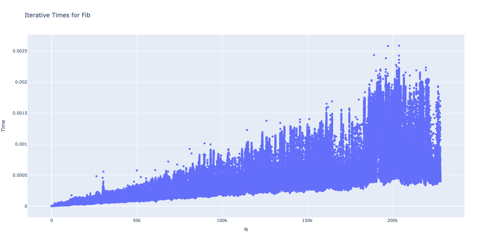

# Week 2

> Time to diverge a little

This week we are going to cover the same content as the tutorial but in a more natural way.  We are going to prove things both experimentally and 'theoretically' rather than just rely on the shoulders of CS history.

## Recursion and the Stack

Time for some drawing + explanation of Fib.

And a real example of performance of fibonnaci.

Results of our fib experiments...

All the source code is [here](https://github.com/BraedonWooding/CompTutoring/tree/main/docs/T2/2521/Tute1) and below is just the fib code.

```c
#include "recursion.h"

/*
                             fib(5)
                            /     \
                           /       \
                          /         \
                         /           \
                       fib(4)          ------fib(3)---
                      /       \                /      \
                   fib(3)      fib(2)         fib(2)  fib(1)
                  /   \         /     \        /   \
                fib(2) fib(1)  fib(1) fib(0) fib(1) fib(0)
                /    \
              fib(1) fib(0)
 */

    /*

        1, 1, 2, 3, 5, 8, 13, 21, ...

        fib(n) =
            IF n <= 1: 1
            OTHERWISE: fib(n - 1) + fib(n - 2)

     */

/*


 */

int fib_rec(int n) {
}

// 1, 1, 2, 3, 5, 8, 13, ...

int fib_upwards(int n) {
}

int fib_memo(int n) {
}
```

<details>
<summary>Performance Graphs for Recursive</summary>


</details>

<details>
<summary>Performance Graphs for Iterative</summary>



</details>

<details>
<summary>Performance Graphs for Memo</summary>


</details>

### 1) Polynomial Calculator

Let's say you have a function like; $$p(x) = a_0 + a_1 x + a_2 x^2 + \dots + a_{n-1} x^{n-1} + a_n x^n $$

Now let's say we want to calculate that expression, what's the fastest way?

Well a very 'quick way' is

```c
// note length of a is going to be n + 1 since it goes from a_0 to a_n
int evalPoly(int n, int a[], int x) {
    int result = 0;
    for (int i = 0; i <= n; i++) {
        // pow(x, i) is going to do x^i
        // i.e. pow(2, 3) is 2^3 = 2 * 2 * 2 = 8
        result += a[i] * pow(x, i);
    }
    return result;
}
```

1. How fast is this?
2. How fast is pow?  Keep in mind it's just a simple implementation like the next question (not the O(logn) though that doesn't matter we'll make it faster than that even).
3. Can we eliminate pow?  Can we refactor the polynomial?

<details>
<summary>More Hints</summary>

Refactoring polynomial gives us

$$ p(x) = a_0 + x * (a_1 + x * (a_2 + x * \dots)) $$

You'll notice that there are only `n` multiplications now as long as we keep track of the previous `x` result.

</details>

<details>
<summary>Answer</summary>

1. `O(n^2)` since `pow(x, n)` is `O(n)` (or `O(n log n)` if you want to be pedantic)
2. Pow is `O(n)` or `O(log n)`
3. Yes!  Refactoring is in hints.

Solution is

```c
int evalPoly(int n, int a[], int x) {
    int result = 0;
    int cur_x = 1;

    for (int i = 0; i <= n; i++) {
        // cur_x is multiplied by x each time
        // so it goes * 1, * x, * x^2, ... as expected
        result += a[i] * cur_x;
        cur_x *= x;
    }
    return result;
}
```

Crazy Ideas: Can you go faster?  What if we just want an 'approximate' solution?

</details>

### 2) Binary Search Recursively

```c
// returns index of matched value and -1 if no index found
int binarySearch(int A[], int n, int value) {
	int lo = 0;
	int hi = n - 1;
	while (lo <= hi) {
		int mid = (lo + hi) / 2;
		
		if (A[mid] == value) {
			return mid;
		} else if (value < A[mid]) {
			hi = mid - 1;
		} else {
			lo = mid + 1;
		}
	}
	return -1; // can't find value
}
```

Rewrite above recursively using the following signature.

```c
// think of base case!  i.e. when in middle
int binarySearch(int A[], int lo, int hi, int value) {
    //  TODO
    return -1;
}

// called like binarySearch(array, 0, length, myValue)
```

And if you really want you can try matching it to the following signature

```c
// binary search without low/high variables :O
// and no you can't create another function!  This is your only one
int binarySearch(int *A, int length, int value) {
    // TODO
    return -1;
}
```

<details>
<summary>Answer</summary>

```c
// think of base case!  i.e. when in middle
int binarySearch(int A[], int lo, int hi, int value) {
    // no more 'places' to look
    if (lo > hi) return -1;

    int middle = (lo + hi) / 2;
    if (value < A[middle]) {
        // Therefore value must be before A[middle]
        return binarySearch(A, lo, middle - 1, value);
    } else if (A[middle] < value) {
        // Value must be after A[middle]
        return binarySearch(A, middle + 1, hi, value);
    } else {
        // Found value
        return middle;
    }
}

// called like binarySearch(array, 0, length, myValue)
```

And if you really want you can try matching it to the following signature

```c
// binary search without low/high variables :O
// and no you can't create another function!  This is your only one

// NOTE: this is actually significantly easier to conceptualise!!
//       try to avoid just converting while -> recursion look the previous function
int binarySearch(int *A, int length, int value) {
    // no where else to look!
    if (length == 0) return -1;

    // lo = 0, hi = length - 1 therefore lo + hi = 0 + length - 1
    int middle = (length - 1) / 2;
    if (value < A[middle]) {
        // Value before middle
        // just 'middle' not middle - 1 since we are passing it in as a length
        // i.e. for an array of length 4 (1, 2, 3, 4) our index is (4 - 1) / 2
        //      which is 3 / 2 -> 1, therefore if value < A[1] (i.e. value == 1)
        //      the new array is [0, 1) or rather starts at A and has a length of 1
        return binarySearch(A, middle, value);
    } else if (A[middle] < value) {
        // Value after middle
        // we add 1 here because it's an index i.e. for our previous example above
        // if value > A[1] (i.e. value > 2) then we want it to be [2, 3]
        // i.e. A starts at A_old + (1 + 1) and goes for middle + 1 elements (2)

        // what we move forward by we have to remove from our length
        // i.e. if we move [1, 2, 3, 4] -> [3, 4] the start moves forwards 2
        //      and the length goes down by 2
        return binarySearch(A + middle + 1, length - middle + 1, value);
    } else {
        // Found value
        return middle;
    }
}
```

</details>

Hints:
- The use of `*A` vs `A[]` indicates pointer math may be needed
    - NOTE: there is no difference between the two (arrays are only special when created in function locally)
- This is a more 'typical' approach to recursion, try to think up of a wave to make the array physically smaller by manipulating length/starting point (A) rather than low/high.

### 3) Extension: Pow (hard only if you feel like it)

> I have 0 clue why this was in the notes, the solution is NOT intuitive so do not feel bad for googling but what I recommend is having a look at this 'reasonably' simple equation.

For $$x^n$$ IF:
- `n` is odd: $$x^n = x * (x^2)^{\frac{n - 1}{2}}$$
- `n` is even: $$x^n = (x^2)^{\frac{n}{2}}$$

First prove those equations to yourself (I'll do a very quick 'proof') then try to use them to solve this.

We need to convert the following equation to O(log(n)) rather than O(n) this is using something called divide and conquer i.e. split it up into smaller parts which are easier to solve.

```c
// calculate x raised to the power of n
// i.e. pow(3, 2) is 3^2 = 3 * 3 = 9
// you can presume n is positive.
int pow(int x, int n) {
	int res = 1;
	for (int i = 1; i <= n; i++) {
		res = res * x;
	}
	return res;
}
```

Hints:

1. What is the complexity of Pow?  Think about the 'scaling' factors
2. What is the base case?  The case you can solve easily, solving this recursively is probably easier
3. Prove the math works!  Each time you run it you end up with a smaller `n` factor, until the base factor.

<details>
<summary>Answer</summary>

1. Complexity of base one is `O(n)`
2. Base case of pow is going to be `pow(x, 0)` and `pow(x, 1)` being 1 and x respectively
3. Each time the expression evaluates our `n` gets smaller and smaller till eventually it reaches 0 or 1

We can prove 3 using some simple recurrence proofs (proof by induction)...

We only require that ...

$$
T(x^2, a) = T(x, 2 * a) = T(x, a)^2
$$

This can be very easily proven i.e. 

$$ (x^2)^a = x^(2 * a) = (x^a)^2 $$

$$
\begin{aligned}
\textbf{Base Case} \\
T(x, 0) &= 1 \\
T(x, 1) &= x \\
\textbf{Important presumptions} \\
\textbf{Presuming T(x, k) resolves for constant x} \\
T(x, 2 * k + 1) &= x * T(x^2, \frac{(2 * k + 1) - 1}{2}) = x * T(x^2, k) = x * T(x, k)^2 \\
T(x, 2 * k) &= T(x^2, \frac{2 * k}{2}) = T(x^2, k) = T(x, k)^2
\end{aligned}
$$

You can prove it many other ways but that's probably the simplest.

```c
int pow(int x, int n) {
	if (n == 0) return 1;
	if (n == 1) return x;
	if (n % 2 == 0) {
        // n is even
		return pow(x * x, n / 2);
	} else {
        // n is odd
		return x * pow(x * x, (n - 1) / 2);
	}
}
```

We can even write a tail call recursive function (why isn't the previous one tail call recursive?)

```c
// c is the 'const' factor
int actual_pow(int c, int x, int n) {
    // notice we have no 'actual' actions to perform after our return!
    if (n == 0)             return c;
    else if (n == 1)        return c * x;
    else if (n % 2 == 0)    return actual_pow(y, x * x, n / 2);
    else                    return actual_pow(y * x, x * x, (n - 1) / 2);
}

int pow(int x, int n) {
    return actual_pow(1, x, n);
}

// and for those who want to feel pain, the same one as a ternary
int actual_pain(int c, int x, int n) {
    return (n == 0 ? c
        :  (n == 1 ? c * x
            : (n % 2 == 0 ? actual_pain(y, x * x, n / 2)
                : actual_pain(y * x, x * x, (n - 1) / 2)
            )
        )
    );
}
```

NOTE: COMP 2521 is not a math class, you do not require heavy math.  This question in my opinion wasn't a brilliant question so don't fret if you found it too hard, it was intentionally obtuse by requiring a mathematical intuition.

</details>

### Any more?

You can check webcms tutorial notes for more problems.

