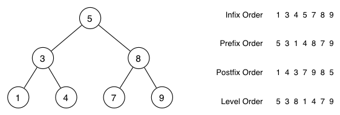

# Wk 4

<!-- for me -->
<!-- [Whiteboard App](https://app.ziteboard.com/) -->

### Traversals



- What trees have infix == prefix?
- What trees have all orders being the same?

### Some code examples

```c
// counts #nodes in a tree
int BSTreeNumNodes(BSTree t) {
    return -1;
}
```

```c
// counts number of odd numbers in tree
int BSTreeCountOdds(BSTree t) {
    return -1;
}
```

```c
// counts height of tree which is defined
// as longest path from root -> leaf, you count the number of edges
// not nodes!

// you can presume height to be 0 or -1 for empty tree
// (question will typically specify otherwise either is fine)
int BSTreeHeight(BSTree t) {
    return 0;
}
```

```c
// counts number of internal nodes
// internal nodes have atleast one subtree (i.e. aren't leafs)
int BSTreeCountInternal(BSTree t) {
    return 0;
}
```

```c
// returns the path length from root to the node with value specified
// again path length is number of links, so if value == root: depth = 0
// returns -1 for value not found.
int BSTreeNodeDepth(BSTree t, int value) {
    return -1;
}
```

```c
// counts number of items greater than val
// can we avoid any unnecessary comparisons?
int BSTreeCountGreater(BSTree t, int val) {
    return -1;
}
```

<details>
<summary> Answer </summary>

```c
// counts #nodes in a tree
int BSTreeNumNodes(BSTree t) {
    if (t == NULL) return 0;
    return 1 + BSTreeNumNodes(t->left) + BSTreeNumNodes(t->right);
}

// counts number of odd numbers in tree
int BSTreeCountOdds(BSTree t) {
    if (t == NULL) return 0;
    return (t->data % 2 != 0) + BSTreeCountOdds(t->left) + BSTreeCountOdds(t->right);
}

// counts height of tree which is defined
// as longest path from root -> leaf, you count the number of edges
// not nodes!

// you can presume height to be 0 or -1 for empty tree
// (question will typically specify otherwise either is fine)
int BSTreeHeight(BSTree t) {
    if (t == NULL) return 0;
    if (t->left == NULL && t->right == NULL) return 1;

    int left = BSTreeHeight(t->left);
    int right = BSTreeHeight(t->right):
    return 1 + (left > right ? left : right);
}

// counts number of internal nodes
// internal nodes have atleast one subtree (i.e. aren't leafs)
int BSTreeCountInternal(BSTree t) {
    if (t == NULL) return 0;
    if (t->left == NULL && t->right == NULL) return 0;

    return 1 + BSTreeCountInternal(t->left) + BSTreeCountInternal(t->right);
}

// returns the path length from root to the node with value specified
// again path length is number of links, so if value == root: depth = 0
// returns -1 for value not found.
int BSTreeNodeDepth(BSTree t, int value) {
    if (t == NULL) return -1;
    if (t->data == value) return 0;

    int depth;
    if (value < t->data) {
        depth = BSTreeNodeDepth(t->left, value);
    } else {
        depth = BSTreeNodeDepth(t->right, value);
    }

    return depth == -1 ? -1 : depth + 1;
}


// counts number of items greater than val
// can we avoid any unnecessary comparisons?
int BSTreeCountGreater(BSTree t, int val) {
    if (t == NULL) return 0;

    if (t->data > val) {
        return 1 + BSTreeNumNodes(t->right) + BSTreeCountGreater(t->left, val);
    } else {
        // t->data <= val
        return BSTreeCountGreater(t->right, val);
    }
}
```

</details>

### Recommended Activities

```c
// Sum all nodes in t
int BSTreeSum(BSTree t) {
    if (t == NULL) return 0;
    return t->data + BSTreeSum(t->left) + BSTreeSum(t->right);

    // single node, no children
    // if (t->left == NULL && t->right == NULL) return t->data;
    // internal (has children) node, only left child which is a leaf (has no children)
    // if (t->left != NULL && t->left->left == NULL && t->left->right == NULL && t->right == NULL)
    //    return t->data + t->left->data;
    // internal node, only right child which is a leaf
    // if (t->right != NULL && t->right->left == NULL && t->right->right == NULL && t->left == NULL)
    //     return t->data + t->right->data;
    // internal node, left and right child which are both leaves
    // if (t->right != NULL && t->right->left == NULL && t->right->right == NULL && t->left != NULL && t->left->left == NULL && t->left->right == NULL)
    //     return t->data + t->left->data + t->right->data;
}
```

```c
// Move the node that matches the given key to root
// making sure that the invariants of BST aren't broken.
// You can do nothing if value not found.
BSTree BSTreeMoveUp(BSTree t, int value) {
    return NULL;
}
```

The last one probably needs some more hints so here you go!

A very 'simple' way would be to simply just move the node then find places for the other nodes so that you don't lose invariant.

```c
/*
    i.e. moving 9 up to the top here, we'll begin by just moving it there

         6
        / \
       /   \
      /     \
     5       7
    /         \
   3           9
  / \         / \
 2   4       8  10

    Then we are just going to move the root to the correct child (left / right)
    and the child that we displace we are just going to re-add onto the tree

             9
            / \
           /   \
          /     \
         6      10
        / \
       5   7
      /     \
     3       8
    / \
   2   4

 */
```

This produces very awkward graphs but is pretty much what a 'rotation' however a more professional way is...

(note you'll have to perform multiple rotations to move elements up as opposed to the other method).

```c
/*
  For example if we have the following and want to move '9' up
  we have to 'rotate' 7 down to the left (a left rotation)
      7
     / \
    /   \
   3     9
  / \   / \
 2   5 8  10

 A left rotation on '7' will be
 1)
     7
    / \
   3   8
  / \
 2   5
 
 right = 9
        / \
       8  10
       
 2)
       9
      / \
     7  10
    / \
   3   8
  / \
 2   5
*/

/*
  For example if we have the following and want to pull 3 up
  then we have to rotate '7' down to the right.

      7
     / \
    /   \
   3     9
  / \   / \
 2   5 8  10

 A right rotation on '7' will be
 1)
     7
    / \
   5   9
      / \
     8  10

 left  = 3
        / \
       2   5

 2)
       3
      / \
     2   7
        / \
       5   9
          / \
         8  10
*/
```

## Function Pointers

> This diverges from the tute, since personally I don't like examples like they gave.

To understand function pointers we have to first understand what a function is!

### What is a function?

A function is simply just a pointer to a location in memory, however this time it's memory that contains 'code' or instructions!  We can ask the computer to 'jump' to this code!

Investigation...

```c
int foo(int a) {
   return a; 
}

int bar(void) {
    return foo(42);
}

int main(void) {
    // Function pointers are really ugly
    // the way they are done are...
    // 'return type' (*'name')('args')
    // i.e. typedef int (*foo_fn)(int)
    int (*ptr)(int) = &foo;

    // this is 'technically' fine on most compilers
    // but some environments it won't work since
    // sizeof function_ptr != sizeof ptr (funnily enough)
    // void *ptr_void = &foo;

    printf("%p\n", ptr);
    return 0;
}
```

We can even read the 'raw' instructions from them...!!

<details>
<summary>Answer/Hint</summary>

[Tool](https://braedonwooding.github.io/BitwiseCmpViz/#/)
[MIPS Format](http://max.cs.kzoo.edu/cs230/Resources/MIPS/MachineXL/InstructionFormats.html)

<iframe width="800px" height="200px" src="https://godbolt.org/e#z:OYLghAFBqd5QCxAYwPYBMCmBRdBLAF1QCcAaPECAM1QDsCBlZAQwBtMQBGAFlICsupVs1qhkAUgBMAISnTSAZ0ztkBPHUqZa6AMKpWAVwC2tQVvQAZPLUwA5YwCNMxEAGZOpAA6oFhdbT1DE0FvXzU6Kxt7IycXd0VlTFV/BgJmYgJA41MPJRVw2lT0gki7R2c3XLSMrOCq4tLo2MqASkVUA2JkDgByKVdrZEMsAGpxVx0FAnxUADoEcexxAAYAQRXV6wIRmlQILZHmFrGAdlk1kcviTAJO2kPx6TG18ROAEQ2Ng4d0iAA3VB4dDHV7nVaXK43O47VB7biSFqPT7vT5rAFAna0fb0EYQABUngIxBa2IILRBZw2EJGhOIEB%2BdPJSJeKJeawORmY1n%2BgOBpzB1IA9IKRgAxAy0ZJ0GmA%2BjOBSHa4ja5sVgATxGBmA6qpEOFIwICEwIwA7swNYbMBr0sb0HRjTbZk7dZd9WAetdbsR7gQ1Z5MO7cXj3bRmEYAz0Se70sAFO7ERc9SK8LNMLMDX7MFgqCMDvjdgB9Ki0ElbBPgiF5glE0v0EGuN5jSQANl2zIrl08xC2VAgUkkAAUibmFSAmwBWTzicc6Wj90g0mvt6kS3zAGzoXM44jME1jBsjPGkvEk2mI1xgl2YiBn5cQq9dnt9ySSUV4YhTLdTYgGKX3PAKssAAeUjjiBM5zi%2BC47ia54ChCq54OuWZbtsqCePujYQDB%2B5LK42AjC2IItiMwGuFQd6XIhyGbgcH6YbiOGLIshGcMRzakUBnAUReV7URuqHKts4xYUx%2BEsZwzbsZx3GUZqtBrgJBx4EYRgMUxJHAVQ2k8Zeiadt29C9v2wGgUBnFmRZkhgVZYHTrO84jOh0EKNBBALipRhwVe%2BpGHgngKt%2Bv5esaNDEIc/5fkSqIdiM%2BphZqCqEO6gWsEhCAEOqIz4NpzhaNsEBAQAHFJV7IAg6SHugzBpAxEDlekJ5SM2MFyY%2BRnPpIpnWeZ3U2X1vUgT19mQZIC5aTmzXZTVzDTtIyzTm841AdpTYcdVaRzZwi3LatU0bbN47SJIO2cXtJEHXNriLd5bKxZ60ILbxLJvJGQggD0449KQpg9Ms32oB9OhyHIIwKB0XTGv0nDfQQH3/eSpBGswWAuBAbQANZuK4syuHj%2BMEwTzbvT03Dfb9/2kIDPTfQoIDLKQcN/W9cCwEgaBGJ4eDsGQFD1agnPcxUQwiMAnCcMsHhUNzBDypQDjw99DjWOkaqK6QHPhvQADytDqurWCcqI7AG%2B%2BSRqH8mB08zpCYEBSQGLLH0w%2BQcqsOraUODuxBqnoWDq0SKmK20ND0EwbAcDw/CCMIogoCDMhCHgDh05AbToQU1u04kf6aNotQ5K4tvaI05QuCcXg%2BH4dAF1wRehNXtClzEFQV3k5spNUmT6NkdcJPkncNNYZQt%2BXihd7XnBF1MQ9RGXIAnG04OdN0XBtO7n3k%2Br1PFc2AC0zbcCMIuiCM4uzMssycLiuCECQTbxCMeiCzzD9sU/CfSLDweY9juOEwAvGxMN5kx%2BtvD6tN6aM2DqQVmiAQB2wdkQXmlAYwKAHCIZQDAECoBNL9F2HMubCAKBgmwrBsG4Ipt9QhQsXAnzFhLDwNCeba0dhQvB6tEHIFWMQWMEDbb22QKkfAv1vqh0YCwE2UcBAeFjmIT%2BScU7wHToSfwWd2gr0juPERpCsE4I4T0F2JodyeGdm9DeX0wE2x3iVA%2BR96Fn04BfK%2BIxsCCMdvfCAt9kFv2OMDGQchv7M0RljPG/9AGExJqAqhVN%2BF0wZkzBG68PqSC3tY/hiTIxtEth%2BfwIBuBAA%3D%3D%3D"></iframe>

</details>

## Use cases; qsort

```c
#include <stdio.h>
#include <stdlib.h>

/*
    1:  if a > b
   -1:  if a < b
    0:  if a == b

i.e. strcmp
 */
int cmpfunc(const void *a, const void *b) {
    return ( *(int*)a - *(int*)b );
}

int main () {
    int values[] = { 88, 56, 100, 2, 25 };
    int length = sizeof(values) / sizeof(values[0]);

    printf("Before sorting the list is: \n");
    for(int n = 0 ; n < length; n++) {
        printf("%d ", values[n]);
    }

    qsort(values, length, sizeof(int), cmpfunc);

    printf("\nAfter sorting the list is: \n");
    for(int n = 0 ; n < length; n++) {   
        printf("%d ", values[n]);
    }

    return(0);
}
```

## Use cases; bsearch

Let's write our own

```c
// Binary search
void *my_bsearch(const void *key, const void *first, size_t length, size_t sizeof_bytes, int (*compare_fn) (const void *, const void *)) {
    // no where else to look!
    if (length == 0) return NULL;

    // lo = 0, hi = length - 1 therefore lo + hi = 0 + length - 1
    int middle = (length - 1) / 2;
    void *el = (void*)(first + middle * sizeof_bytes);
    int cmp = compare_fn(key, el);

    if (cmp < 0) {
        // Value before middle
        // just 'middle' not middle - 1 since we are passing it in as a length
        // i.e. for an array of length 4 (1, 2, 3, 4) our index is (4 - 1) / 2
        //      which is 3 / 2 -> 1, therefore if value < A[1] (i.e. value == 1)
        //      the new array is [0, 1) or rather starts at A and has a length of 1
        return my_bsearch(key, first, middle, sizeof_bytes, compare_fn);
    } else if (cmp > 0) {
        // Value after middle
        // we add 1 here because it's an index i.e. for our previous example above
        // if value > A[1] (i.e. value > 2) then we want it to be [2, 3]
        // i.e. A starts at A_old + (1 + 1) and goes for middle + 1 elements (2)

        // what we move forward by we have to remove from our length
        // i.e. if we move [1, 2, 3, 4] -> [3, 4] the start moves forwards 2
        //      and the length goes down by 2
        return my_bsearch(key, first + (middle + 1) * sizeof_bytes, length - middle + 1, sizeof_bytes, compare_fn);
    } else {
        // Found value
        return el;
    }
}
```

## Binary Search Trees and Rotations / Balancing

1. Show how the following tree would change if we do a right rotation on the node containing 10 followed by a left rotation on the node containing 6.


2. Show the sequence of rotations that would be required to move the node containing the 7 to the root of this binary tree:


NOTE: Answers on under webcms.

### Height Balanced

Implement the following function that returns the height of a given basic binary tree if it is height-balanced. Otherwise, if the given binary tree is not height-balanced, the function returns NOT_HEIGHT_BALANCED.

__Height-balanced tree:__ We say that a basic binary tree is height-balanced if, for every node, the absolute difference between the height of the left subtree and the height of the right subtree is one or less. In other words, every node needs to satisfy the following criteria: `abs(height(left) - height(right)) ≤ 1`

```c
#define NOT_HEIGHT_BALANCED -99

// just a very simple abs function so we don't need math.h
int abs(int x) { return x < 0 ? -x : x; }

typedef struct BSTNode *BSTree;
typedef struct BSTNode {
	int value;
	BSTree left;
	BSTree right;
} BSTNode;

int isHeightBalanced(BSTree t) {
	if (t == NULL) return -1;
 
	int left = isHeightBalanced(t->left);
	int right = isHeightBalanced(t->right);
 
	// at least one of the subtrees is not height balanced
	if (left == NOT_HEIGHT_BALANCED || right == NOT_HEIGHT_BALANCED)
		return NOT_HEIGHT_BALANCED;
 
	int diff = left - right;
    // abs(diff) has to be <= 1
	if (abs(diff) > 1) return NOT_HEIGHT_BALANCED;
 
	// so far the tree is height balanced; return height
    return (left > right ? left : right) + 1;
}
```

