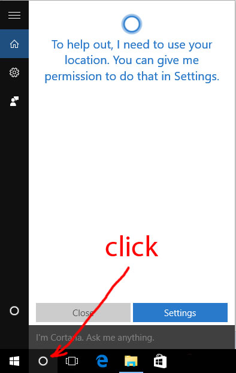
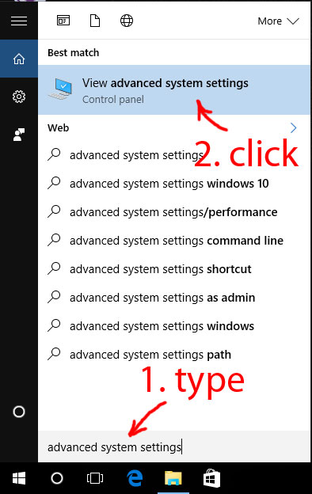
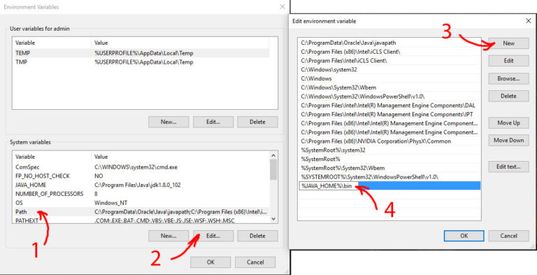
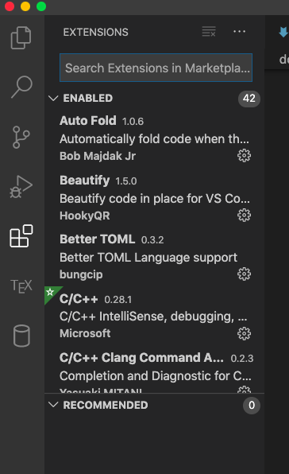
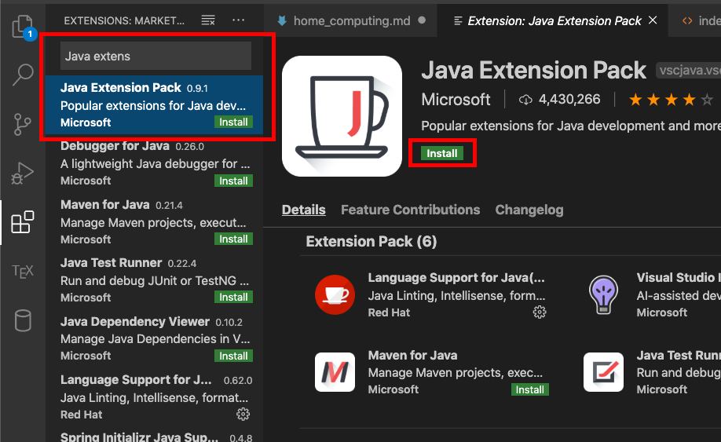

# Home Computing a full guide

## Java (for 2511 ONLY)

Download Java from [here](https://www.oracle.com/java/technologies/javase-jdk11-downloads.html)

?> You want to download the correct one for your system.  i.e. if you have a Windows x64 system then download the `Windows x64 Installer`.

Then you want to just run the installer.  This should be enough for mac / linux.

If you are on windows there are some cases where you'll need to add Java and Javac to your path

> Javac is the compiler, Java is the runtime that runs the compiled code.

### Adding Javac / Java to Windows Path

Begin by finding the system variables by following the following 3 steps;





Then what you want to do is to navigate to Path as below and click 'new';



You'll want to copy and paste the path to your Javac and your Java in this list.

!> You may have to do it twice (press new twice and put each one in it's own item) if the paths are different.

The paths should be something like `C:\Program Files\Java\jdk-something\bin` and you should just have to add that (have a look in file explorer/finder to find the exact path).

?> The course says you can run `where java` or `where javac` so you could also try that :D

## VS Code with Java Extensions (again 2511)

1. Navigate and download [VS Code](https://code.visualstudio.com/download).
2. Begin vscode by either typing `code` or by opening up the application as you usually would
3. Go to VSCode Extensions tab (like below)



4. Next type in `Java Extension Pack` and click install (like below)



5. Do the same for `Code Runner`.

And everything should be good from now on.  I'll go through how to use everything in the tute but the online tute provided does mention some tips.

## VLAB

Here is a [link](https://cgi.cse.unsw.edu.au/~cs1511/19T3/home_computing/vlab.html) to the downloads and instructions for vlab.

## SSH

SSH allows you to use the terminal as if you were on a CSE computer despite being at home.

### Windows
 
Install putty [here](https://www.chiark.greenend.org.uk/~sgtatham/putty/latest.html).

In the host name put `zID@cse.unsw.edu.au` (i.e. put your zID including the z)

?> Note you may have to put `zID@login.cse.unsw.edu.au` as the host name if above doesn't work.

### MacOS/Linux

You should just be able to write `ssh zID@cse.unw.edu.au` and it should work!

If you want it to save your password so you don't have to enter it each time do the following...

#### Create a config directory

!> If you already have one (i.e. you have done 1531 and setup ssh github support) than don't do this step

```bash
mkdir ~/.ssh
cd ~/.ssh
```

#### Generate SSH Login Key Pairs

Make sure you are in your `~/.ssh` directory.

`ssh-keygen -f ~/.ssh/cse_id_rsa -t rsa -b 4096 -C “zID@cse.unsw.edu.au”`

#### Copy one of the pairs to CSE

Use the following;

`ssh-copy-id -i ~/.ssh/cse_id_rsa.pub zID@cse.unsw.edu.au`

#### Add Private Key to SSH Agent

##### Linux

```bash
eval "$(ssh-agent -s)"
ssh-add ~/.ssh/cse_id_rsa
```

##### Mac

```bash
eval "$(ssh-agent -s)"
ssh-add -K ~/.ssh/cse_id_rsa
```

#### Add configuration options so you can write `ssh cse`

Open a file called `~/.ssh/config` and write the following;

```
Host cse
    User zID
    HostName weber.cse.unsw.edu.au
    IdentityFile ~/.ssh/cse_id_rsa
```

##### Mac's have to write something extra if you are using > Sierra 10.12.2

Add this at the bottom of your `~/.ssh/config` file.

```
Host *
    AddKeysToAgent yes
    UseKeychain yes
    IdentityFile ~/.ssh/cse_id_rsa
    #IdentityFile ~/.ssh/rpi_id_rsa
```

## SSH with GUI i.e. using gedit over ssh

Follow the following [guide](https://taggi.cse.unsw.edu.au/FAQ/Install_an_X_server/)

### Macs/Linux need something extra

You'll need to also write in your `~/.ssh/config` file under `Host cse` the following after you've installed an X server.

```
    ForwardX11Trusted yes
    ForwardAgent yes
    ForwardX11 yes
    XAuthLocation /opt/X11/bin/xauth
```

## Silence the welcome message

Connect to cse and once you are connected type `touch ~/.hushlogin`.

## Remote File System

I'm not too sure about this for anything but Mac but I'll try.

### Get SSHFS

#### Windows

!> I haven't tested this method I can't vouch for whether or not it will work!

Download [this](https://win-sshfs.googlecode.com/files/win-sshfs-0.0.1.5-setup.exe) and install it.

Just then open up the executable and follow the instructions.  Should be relatively straight forward.

#### Mac

I recommend installing homebrew it makes this process really easy and it is super necessary to have homebrew for future courses and your industry career as it is the goto for installing software on a mac.  You can install it here [homebrew](https://brew.sh/).

You'll need osxfuse install it like `brew cask install osxfuse`.

You'll also need sshfs install it like `brew install sshfs`.

IF you don't want to use brew you can also install them manually [here](http://osxfuse.github.io/).

#### Linux (Ubuntu/Debian)

Use apt-get i.e. `sudo apt-get install sshfs`

### Create mount directory (for mac/linux)

Create a directory for where you want it to be hosted on your computer.

I put mine on my desktop like `mkdir ~/Desktop/CSE` but it is up to you.

### Setup the sshfs (for mac/linux)

You can set it up permanently but I've never had much luck getting it to work so instead I just have a command that I run when I want it to open.

Both of the below commands just closes down the connection (if it is still open) then connects to the cse servers than opens the folder for convenience.  If you don't wish to open the folder at the end just remove the `; open FOLDER` part.

If you are using bash (if you aren't sure you are) add the following to the bottom of your `~/.bashprofile`.  If you are using zsh add it to your `~/.zshrc`.

NOTE: Neither of these commands use sudo but it may mean that it may get stuck and you may have to forcefully shut it down.  This should never occur on macs on linux it may occur and you may have to write `sudo umount FOLDER`.

!> Change FOLDER to whatever folder you are using in my case it was `~/Desktop/CSE`

!> NOTE: You have to have set up ssh like previously stated in this document for this to work

#### MacOS

```bash
alias cse='diskutil unmount force FOLDER; sshfs cse: FOLDER; open FOLDER
```

#### Linux

```bash
alias cse='umount FOLDER; sshfs cse: FOLDER; open FOLDER
```
